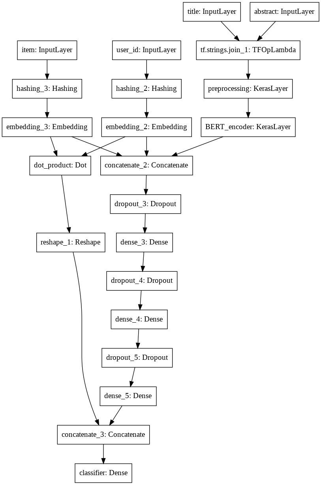

# nlp-recommender
A NLP-based recommender system for a simplified version of the MIND-small dataset.

## Description 
This project constructs a recommender model using deep learning architecture and NLP techniques. The dataset consists of (1) user-news interactions and (2) news titles and abstracts. The model predicts whether the user will click on an unseen news article. 

## Goals 
1. Design a deep learning network that can take as input user-news items and output a binary variable (1/0) for prediction of user clicking on article 
2. Build and train the model using a Python deep learning library 
3. Test the model against user-news combinations not seen in training 
4. Report on the performance of the model 

You can read about the original dataset at [https://github.com/msnews/msnews.github.io/blob/master/assets/doc/introduction.md](https://github.com/msnews/msnews.github.io/blob/master/assets/doc/introduction.md). For the purpose of this project, only the user-news interactions and news titles and abstracts columns will be utilized. 

## Design Approach

The code is divided into two notebooks:

1. [EDA and data preparation](https://colab.research.google.com/drive/1g3b7Yzy5NOX6qG_nLans_1PZY9gGr4SH?usp=sharing)

    1. Exploring the dataset to understand its characteristics. 

    2. Merge data to 1 pandas dataframe that can be further ingested.

2. [Sampling, Training, and Evaluation](https://colab.research.google.com/drive/1ZYK-kL9b4NrPxBBDrzdNmkzZ5n_wWN4k?usp=sharing)

    3. Sample the data to 10% of users

    4. Transfer Learning BERT Model

    5. Model Definition to Evaluation

The emphasis of this approach is that a simple tokenization model could be outperformed by better preprocessing techniques with a rich understanding of language.

The model seeks to leverage the content of text data for the title and abstract columns, by transfer learning with a BERT model. In order to best predict clicks, a hybrid approach was utilized, coupling BERT output with user and item embeddings. The model utilizes TensorFlow preprocessing layers and the tf.dataset file format with data caching for ease of deployment and performance.

## Sampling Methodology

Data was sampled by randomly selecting 10% of users and keeping their respective interactions. This ensures that each user has the most comprehensive interaction set available for training. The remaining 90% of users were reserved for cold-start user evaluation.

Once users were sampled, the subset of data was manually verified to demonstrate the same balance of click labels were used as the original data (80% no click).

## Training/Testing Methodology

The sampled data was split into 60/20/20 train, validation, and test splits. Data was shuffled, and stratified on users to ensure a random, balanced dataset with meaningful predictions per user. The balance of the target variable "click" was manually verified, but left out of the stratification to allow for users without both click labels to be included in the dataset.

As an additional test of the model, cold-start users were also evaluated (users selected from the 90% of data not included). 

<table>
  <tr>
    <td>10% of users Stratified Sample</td>
    <td></td>
    <td></td>
    <td>90% of users
Out of Sample</td>
  </tr>
  <tr>
    <td>Training 60%</td>
    <td>Validation 20%</td>
    <td>Test Set 20%</td>
    <td>Cold Start Evaluation Set</td>
  </tr>
</table>

Binary cross entropy was utilized as a loss function with an Adam optimizer utilizing weight decay. Best weights were loaded from previous training checkpoints for a total of 15 epochs (2+2+1+10). Initial learning rate was set at 3x10-5 and a number of warmup steps set to 10% of the total number of training steps.

## Model Network Architecture

The model utilized a deep component for the user and item embeddings and BERT encodings, as well as a shallow component for the user and item embeddings.

Text preprocessing is perhaps the most crucial task. Simple tokenization models would likely be outperformed by better preprocessing techniques. By utilizing transfer learning with a BERT model (small, uncased, 512), we add contextualized interpretation to the concatenated input sequences (Title and Abstract). 

Including user and item hashing (and text preprocessing) in the model pipeline allows for prediction on previously unseen users and items. Jointly training lower and higher order interactions provide both memorization and expressivity. Dropout layers were utilized for regularization. Lastly, a sigmoid activation function for the final output layer.

## Model Performance

<table>
  <tr>
    <td>Test Set</td>
    <td>Cold-start User Set</td>
  </tr>
  <tr>
    <td>loss :  0.20632344484329224  
fp :  780.0  
tp :  17881.0  
tn :  97755.0  
fn :  6201.0  
accuracy :  0.9430665969848633  
precision :  0.9582015872001648  
recall :  0.7425047755241394  
auc :  0.925247311592102</td>
    <td>loss :  0.21046993136405945  
fp :  33949.0  
tp :  757444.0  
tn :  4219464.0  
fn :  271046.0  
accuracy :  0.9422566294670105  
precision :  0.9571022391319275  
recall :  0.7364621758460999  
auc :  0.9194666147232056</td>
  </tr>
</table>

Model performance shows 94% accuracy across the test and cold datasets. The recall of the model is lower, at roughly 0.74. The AUC of the model, 0.92, performs optimistically compared to the current [MIND leaderboard](https://msnews.github.io/) of 0.72. This discrepancy could stem partly from the difference in data (MIND vs MIND-small), and from the simplification of the problem (i.e. with timestamp data omitted from our dataset, it is much easier to predict if a user clicked on an article once in 6 weeks compared to predicting for a particular session).

The model demonstrates robustness across users:  0.08 percentage point change in accuracy 0.58 percentage point change in auc is perceptible between the holdout set and cold-start users. 

## Production Deployment & Monitoring

### Should the model be deployed at all? 

The context and purpose of our click prediction model is vital to answering this question. If developed as a recommender system for news articles, perhaps an accuracy based model is not the best implemented. Because the dataset is assembled from past click interactions, there is an inherent bias from the previous system: i.e. users can only click on articles they are presented with. Metrics including the diversity, novelty, and serendipity of recommendations may be more fitting in conjunction with user feedback. 

Assuming the model was to be deployed, there are a number of considerations to take into account: data storage and retrieval, frameworks and tooling, and feedback and iteration. A TensorFlow TFX pipeline could be used with TensorFlow serving to provide a RESTful API for model serving utilizing an AWS or GCP infrastructure.

Regarding monitoring, unit tests and manual inspections can be implemented to make sure data structures are consistent. Major areas for monitoring include dependency changes, consistent data invariants and feature computation between training and serving, numerical stability, model recency, performance issues related to data leakage or other resource constraints, and continued prediction quality.

